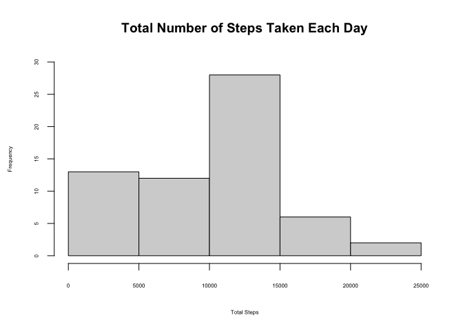
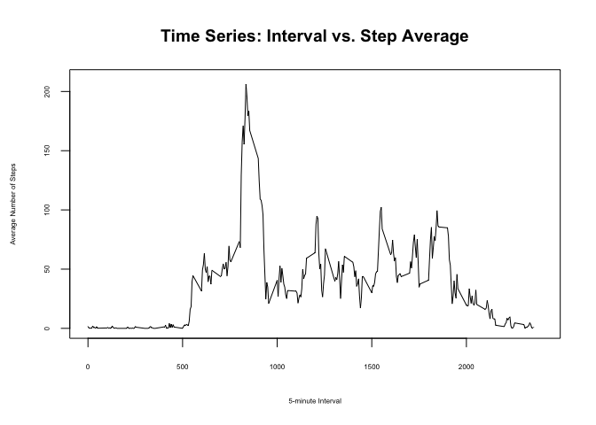
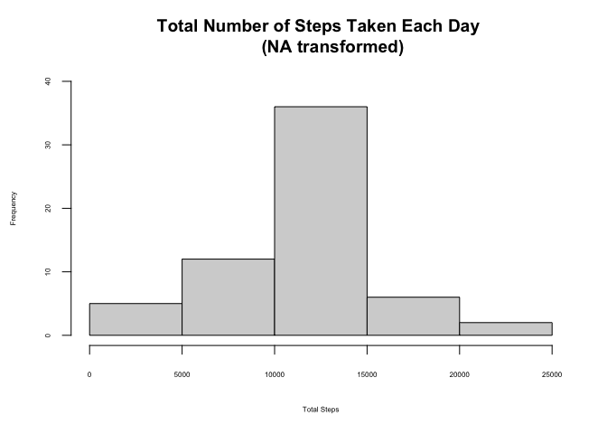
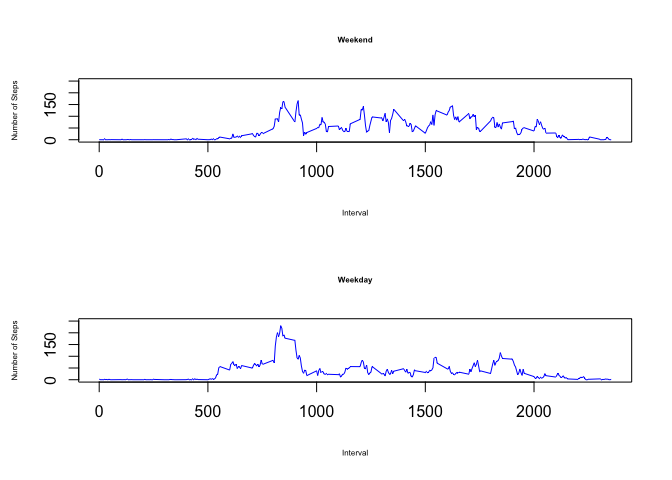

## Loading and preprocessing the data
Here is the code to load the *Activity monitoring data*. Additionally, there is code
to remove NA values from the dataset (Some parts of this assignemnt require the removal
of NA values).


```r
activity.data <- read.csv("/Users/Ayan/Desktop/R Specialization/activity.csv")
activity.data.nona <- activity.data[!is.na(activity.data$steps),]
```


## Histogram of the total number of steps taken each day
Here is the code to calculate the total number of steps taken per day and to create a
histogram to represent it.


```r
date.list <- activity.data$date
date.list <- date.list[!duplicated(date.list)]
total.steps.day <- data.frame(Date = character(), TotalSteps = numeric())

for(d in date.list){
        df1 <- subset(activity.data.nona, date == d)
        total1 <- sum(df1$steps)
        df2 <- data.frame(Date = d, TotalSteps = total1)
        total.steps.day <- rbind(total.steps.day, df2)
}

hist(total.steps.day$TotalSteps, main = "Total Number of Steps Taken Each Day", 
     xlab = "Total Steps", ylim = c(0,30), cex.lab = 0.5, cex.axis = 0.5, cex = 0.5)
```

<!-- -->


## What is mean total number of steps taken per day?
Here is the code that calculates the mean and median of the total number of steps taken
per day. In the output, mean comes first, then median.


```r
mean1 <- mean(total.steps.day$TotalSteps)
median1 <- median(total.steps.day$TotalSteps)

mean1
```

```
## [1] 9354.23
```

```r
median1
```

```
## [1] 10395
```


## What is the average daily activity pattern?
### Time series plot of the average number of steps taken
Here is the code to generate the time plot of the 5-minute interval (x-axis) and the
average number of steps taken, averaged across all days (y-axis). 


```r
interval.list <- activity.data$interval
interval.list <- interval.list[!duplicated(interval.list)]
average.steps.interval <- data.frame(Interval = numeric(), TotalSteps = numeric())

for(i in interval.list){
        df1.1 <- subset(activity.data.nona, interval == i)
        total1.1 <- mean(df1.1$steps)
        df2.1 <- data.frame(Interval = i, TotalSteps = total1.1)
        average.steps.interval <- rbind(average.steps.interval, df2.1)
}

plot(average.steps.interval$Interval, average.steps.interval$TotalSteps, type = "l", 
     main = "Time Series: Interval vs. Step Average", ylab = "Average Number of Steps", 
     xlab = "5-minute Interval", cex.lab = 0.5, cex.axis = 0.5, cex = 0.5, 
     xlim = c(0,2400), ylim = c(0,210))
```

<!-- -->


### The 5-minute interval that, on average, contains the maximum number of steps
This code calculates the 5-minute interval that, on average across all the days in the
dataset, contains the maximum number of steps.


```r
max.interval <- average.steps.interval[which.max(average.steps.interval$TotalSteps),]
max.interval$Interval
```

```
## [1] 835
```


## Imputing missing values
This code deals with the missing values in the dataset. In essence, it calculates the
average number of steps for each 5-minute interval and assigns that value to any NA
value corresponding with that interval. It uses a simple *for* loop to subset each interval, calculate the respective average of steps, assign the value to the NA slots, and combine all of these subsets back into one coherent dataset. Additionally, the first
line of code shows how many NA values there are in the original dataset.


```r
sum(is.na(activity.data))
```

```
## [1] 2304
```

```r
na.fixed <- data.frame(steps = numeric(), date = character(), interval = numeric())
for(i in interval.list){
        df1.3 <- subset(activity.data, interval == i)
        mean1.3 <- mean(df1.3$steps, na.rm = T)
        
        df1.3$steps[is.na(df1.3$steps)] <- mean1.3
        na.fixed <- rbind(na.fixed, df1.3)
}
```


## Histogram of the total number of steps taken each day after missing values are imputed
This code creates a histogram of the total number of steps taken each day and calculates the mean and median total number of steps taken per day. Following the histogram, there
are values of the mean and median of this new, refined dataset, respectively.


```r
total.steps.day.nona <- data.frame(Date = character(), TotalSteps = numeric())
for(d in date.list){
        df1.4 <- subset(na.fixed, date == d)
        total1.4 <- sum(df1.4$steps)
        df2.4 <- data.frame(Date = d, TotalSteps = total1.4)
        total.steps.day.nona <- rbind(total.steps.day.nona, df2.4)
}

hist(total.steps.day.nona$TotalSteps, main = "Total Number of Steps Taken Each Day 
     (NA transformed)", 
     xlab = "Total Steps", ylim = c(0,40), cex.lab = 0.5, cex.axis = 0.5, cex = 0.5)
```

<!-- -->

```r
mean1.4 <- mean(total.steps.day.nona$TotalSteps)
median1.4 <- median(total.steps.day.nona$TotalSteps)

mean1.4
```

```
## [1] 10766.19
```

```r
median1.4
```

```
## [1] 10766.19
```


## Are there differences in activity patterns between weekdays and weekends?
### Panel plot comparing the average number of steps taken per 5-minute interval across weekdays and weekends
This code creates a new factor variable that indicates whether the day was a weekday or
a weekend. Then, it creates a panel plot containing a time series plot of the 5-minute
interval (x-axis) and the average number of steps taken, averaged across all weekday days
or weekend days (y-axis).


```r
na.fixed$date <- as.Date(na.fixed$date, format = "%Y-%m-%d")
na.fixed$day <- weekdays(na.fixed$date)

na.fixed$day[na.fixed$day == "Monday"] <- "weekday"
na.fixed$day[na.fixed$day == "Tuesday"] <- "weekday"
na.fixed$day[na.fixed$day == "Wednesday"] <- "weekday"
na.fixed$day[na.fixed$day == "Thursday"] <- "weekday"
na.fixed$day[na.fixed$day == "Friday"] <- "weekday"

na.fixed$day[na.fixed$day == "Saturday"] <- "weekend"
na.fixed$day[na.fixed$day == "Sunday"] <- "weekend"

na.fixed$day <- as.factor(na.fixed$day)

weekday.df <- data.frame(Interval = numeric(), TotalSteps = numeric(), Day = character())

for(i in interval.list){
        df1.5 <- subset(na.fixed, interval == i & day == "weekday")
        total1.5 <- mean(df1.5$steps)
        df2.5 <- data.frame(Interval = i, TotalSteps = total1.5, Day = "weekday")
        weekday.df <- rbind(weekday.df, df2.5)
}

weekend.df <- data.frame(Interval = numeric(), TotalSteps = numeric(), Day = character())

for(i in interval.list){
        df1.6 <- subset(na.fixed, interval == i & day == "weekend")
        total1.6 <- mean(df1.6$steps)
        df2.6 <- data.frame(Interval = i, TotalSteps = total1.6, Day = "weekend")
        weekend.df <- rbind(weekend.df, df2.6)
}

par(mfrow=c(2,1))
plot(weekend.df$Interval, weekend.df$TotalSteps, type = "l", ylim = c(0,250), 
     ylab = "Number of Steps", xlab = "Interval", col = "blue", cex.lab = 0.5,
     main = "Weekend", cex.main = 0.5)
plot(weekday.df$Interval, weekday.df$TotalSteps, type = "l", ylim = c(0,250), 
     ylab = "Number of Steps", xlab = "Interval", col = "blue", cex.lab = 0.5,
     main = "Weekday", cex.main = 0.5)
```

<!-- -->
